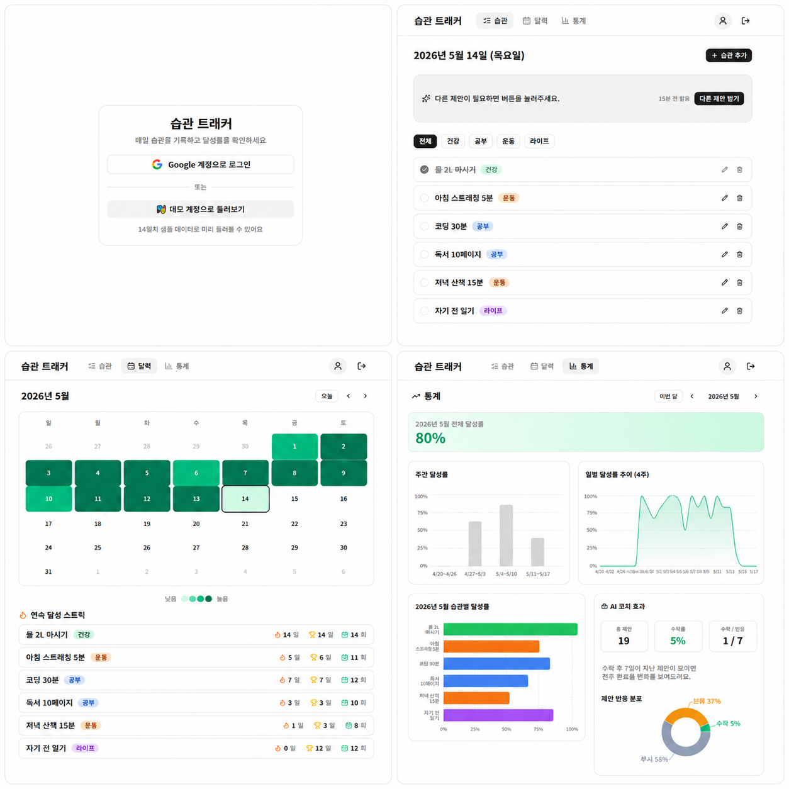
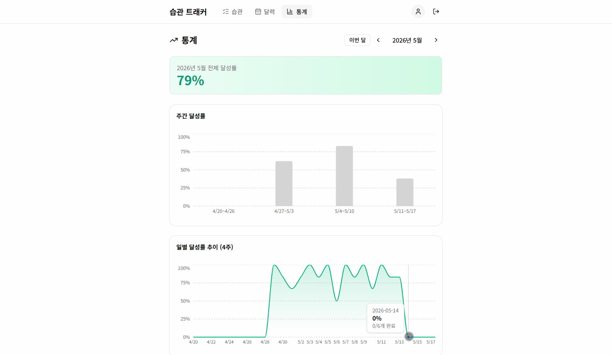
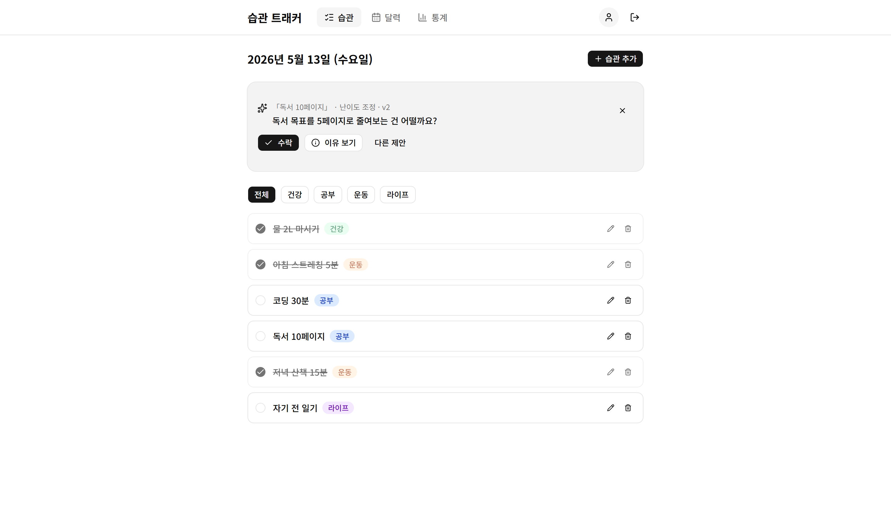
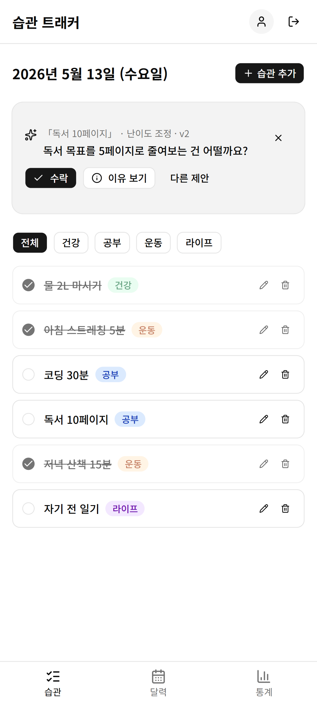
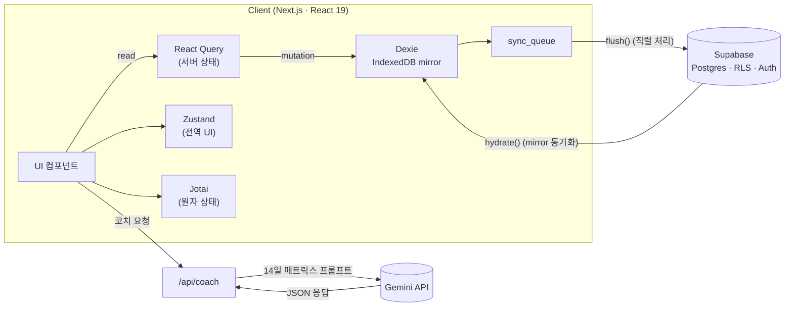

# Habit Tracker

> 오프라인 퍼스트 멀티 기기 동기화와 AI 코치를 갖춘 개인 습관 트래커.
> Next.js 16 · Supabase · IndexedDB · Gemini

- 🔗 **라이브 데모** — <https://habit-tracker-ashy-seven.vercel.app/>
- 🎭 **데모 진입** — 로그인 페이지의 _"데모 계정으로 둘러보기"_ 버튼 한 번 → 14일치 샘플 데이터가 채워진 화면으로 바로 이동합니다.
- 📓 **개발 일지** — [동기화 안정화 사이클 (1주 도그푸딩)](notes/sync-stabilization-log.md)





## 📌 프로젝트 소개

매일 습관을 기록하고 달성률을 시각화하는 개인 생산성 앱입니다.
모바일과 PC를 오가는 사용 환경을 기본 전제로 두고, **오프라인에서도 끊김 없이 작동**하면서 **여러 기기에서 일관된 상태**를 유지하도록 설계했습니다.

## ✨ 주요 특징

### 1. 오프라인 퍼스트 + 멀티 기기 동기화

브라우저의 IndexedDB(Dexie)에 서버 데이터를 미러링하고, 변경 사항은 `sync_queue`에 쌓아 백그라운드에서 Supabase로 전송합니다. 재접속 시에는 hydrate를 통해 서버 상태를 다시 끌어오는 구조입니다.

1주간 직접 사용하며 이 구조에서 발생한 동기화 결함 6가지를 발견·수정하고, 회귀 테스트까지 마무리했습니다. 전체 과정은 [동기화 안정화 일지](notes/sync-stabilization-log.md)에 정리되어 있습니다.

대표적인 사례:

- hydrate의 `bulkPut`이 미러가 아닌 upsert로 동작해, 다른 기기에서 삭제한 데이터가 전파되지 않던 문제
- flush–hydrate 경합으로 삭제된 row가 되살아나는 문제
- signOut 시 로컬 큐를 비우지 않아 다음 로그인 계정으로 이전 변경사항이 푸시되던 사용자 경계 누수 문제

### 2. Gemini 기반 AI 코치





최근 14일치 달성 매트릭스를 프롬프트에 담아 Gemini에 전달하고, **개선 효과가 가장 클 습관 하나**를 선정해 `reschedule / simplify / skip / encourage` 중 한 가지 액션을 제안받습니다. 응답은 `responseSchema`로 JSON 형식을 강제한 뒤 zod로 다시 한 번 검증합니다.

코치의 효과를 측정하기 위해 별도의 텔레메트리 테이블(`coach_events`)을 두었고, 프롬프트 버전(`COACH_PROMPT_VERSION`)을 올리면 **버전별 수락률 비교 차트**가 자동으로 활성화됩니다.

### 3. 상태 관리 3종 분리 (Zustand · Jotai · React Query)

성격이 다른 상태를 한 도구로 처리하지 않고 책임 단위로 나눴습니다.

- **React Query** — 서버 상태 (습관 목록, 로그, 캐싱과 동기화)
- **Zustand** — 전역 UI 상태 (로그인 유저, 선택된 날짜)
- **Jotai** — 컴포넌트 트리 안의 원자 상태 (편집 모드, 드래그 순서)

캐시 무효화 같은 **서버 상태 책임이 React Query 한 곳에 모이도록** 정리한 결과, 멀티 기기 동기화 결함 중 한 가지(주간 파생 키 무효화 누락)를 단일 지점에서 수정할 수 있었습니다. 자세한 설계 근거는 [ADR-002](notes/adr/0002-state-management-split.md)에 정리해 두었습니다.

## 🛠 기술 스택

| 구분          | 기술                                         |
| ------------- | -------------------------------------------- |
| 프레임워크    | Next.js 16 (App Router) · React 19           |
| 언어          | TypeScript                                   |
| 전역 상태     | Zustand                                      |
| 원자 상태     | Jotai                                        |
| 서버 상태     | React Query (TanStack Query)                 |
| 로컬 DB       | Dexie (IndexedDB) · `sync_queue`             |
| 원격 DB       | Supabase (PostgreSQL · RLS · Auth)           |
| AI            | Gemini API (`responseSchema` 기반 JSON 응답) |
| UI            | shadcn/ui · Base UI · Tailwind CSS           |
| 차트          | Recharts                                     |
| 폼            | React Hook Form · Zod                        |
| 테스트        | Vitest · React Testing Library · vitest-axe  |
| PWA           | Serwist (Service Worker)                     |
| 모니터링      | Sentry                                       |
| 패키지 매니저 | pnpm                                         |

## 📁 폴더 구조

핵심 로직의 위치는 다음과 같습니다.

- **오프라인 퍼스트 동기화** → [src/lib/db/](src/lib/db/) (`sync.ts`, `hydrate.ts`, `clearLocalData.ts`)
- **AI 코치** → [src/lib/ai/](src/lib/ai/), [src/app/api/coach/](src/app/api/coach/)
- **React Query 훅 (캐시 무효화 등)** → [src/hooks/useHabitLogs.ts](src/hooks/useHabitLogs.ts)

전체 구조는 다음과 같습니다.

```text
src/
├── app/                      # Next.js App Router
│   ├── (auth)/              # 로그인 라우트 그룹
│   ├── (dashboard)/         # 인증 필요 — habits · calendar · stats
│   ├── api/coach/           # AI 코치 API 라우트
│   └── auth/callback/       # OAuth 콜백
├── components/
│   ├── ui/                  # shadcn/ui 기본 컴포넌트
│   ├── habits/              # 습관 도메인 컴포넌트 (HabitCard, AiCoachCard 등)
│   ├── stats/               # 통계·차트 (DailyTrendChart, WeeklyChart 등)
│   ├── auth/ · layout/ · providers/
│   └── OfflineBanner.tsx
├── hooks/                    # React Query 훅 · 동기화 · 인증
├── lib/
│   ├── db/                  # 오프라인 퍼스트 핵심 — IndexedDB · sync_queue · hydrate
│   │   └── repositories/
│   ├── ai/                  # Gemini 클라이언트 · 코치 로직 · 응답 스키마
│   ├── api/                 # Supabase API 래퍼
│   ├── supabase/            # Supabase 클라이언트 · 미들웨어
│   ├── utils/               # 날짜 · 스트릭 계산
│   └── validations/         # Zod 입력 검증 스키마
├── stores/                   # Zustand — 전역 UI 상태
├── atoms/                    # Jotai — 트리 안 원자 상태
├── tests/                    # Vitest 테스트 (236 케이스)
└── types/                    # TypeScript 타입 정의
```

## 🏗 아키텍처



설계 결정 배경은 ADR 두 건에 정리했습니다.

- [ADR-001 — 오프라인 퍼스트 + sync_queue 도입](notes/adr/0001-offline-first-with-sync-queue.md)
- [ADR-002 — 상태 관리 3종 분리 (Zustand · Jotai · React Query)](notes/adr/0002-state-management-split.md)

## 🔧 트러블슈팅 — 오프라인 퍼스트 동기화 안정화 (ADR-001 · ADR-002)

**문제**

- **기기 간 데이터 불일치** — 모바일과 PC를 오가며 쓰는 환경에서, 오프라인으로 작성한 뒤 다시 접속하면 다른 기기의 변경 사항이 제대로 반영되지 않고 어긋나는 현상이 발생했습니다.
- **삭제가 로컬에 반영되지 않는 문제** — 기존 하이드레이션(hydration)이 `bulkPut`으로만 동작하다 보니, 서버에서 삭제된 레코드가 로컬에 그대로 남는 결함이 있었습니다.
- **동시성 문제** — 재접속 시점에 서버 데이터를 내려받는 하이드레이션과 로컬 변경분을 서버로 올리는 플러시(flush)가 동시에 실행되면서 레이스 컨디션과 HOL(Head-of-Line) 블로킹이 발생했습니다.

**해결**

- **서버 기준 미러링으로 재정의** — 하이드레이션을 변경분(delta) 누적이 아니라 '서버 최신 스냅샷' 기준의 **전체 동기화**로 바꿔, 서버엔 없는데 로컬에만 남아 있던 레코드를 제거했습니다.
- **쓰기 잠금 (locked ids)** — 플러시 중인 레코드 id를 `locked`로 표시해 하이드레이션이 이를 덮어쓰지 못하게 막아, 레이스 컨디션을 구조적으로 차단했습니다 ([hydrate.ts](src/lib/db/hydrate.ts)).
- **재시도 한도** — `MAX_SYNC_RETRIES = 5`를 두어 한도에 도달한 항목은 큐에서 격리·폐기하도록 해, 특정 작업의 반복 실패가 이후 동기화 전체를 막던 문제를 해소했습니다 ([sync.ts](src/lib/db/sync.ts)).
- **캐시 무효화 단일화 (ADR-002)** — 서버 상태 책임을 React Query 한 곳으로 모아, `byDate`/`byMonth`로는 잡히지 않던 주간 파생 키 무효화 누락을 단일 지점에서 해결했습니다 ([useHabitLogs.ts](src/hooks/useHabitLogs.ts)).

**결과**

- 1주간 직접 쓰며(도그푸딩) 아래 동기화·캐시 결함 6가지를 찾아 고쳤습니다.
  - **B1** — 다른 기기에서 지운 데이터가 이 기기에 그대로 남음
  - **B2** — 다른 기기에서 추가한 데이터가 화면에 바로 안 보임
  - **B3** — 삭제·수정 직후 새로고침하면 옛 데이터가 되살아남 (새로고침 경합·오프라인 덮어쓰기 두 갈래)
  - **B4** — 체크해도 통계의 주간 그래프가 갱신되지 않음
  - **B5** — 같은 기기에서 계정을 바꾸면 이전 사용자의 데이터가 따라옴
  - **B6** — 한 번 실패한 동기화 작업이 뒤따르는 작업까지 막음
- 사이클을 마친 뒤에는, 코치가 이미 끝낸 습관에 엉뚱한 제안을 하던 문제(**B7**)와 열어 둔 탭이 다른 기기의 변경을 자동으로 따라오지 못하던 문제(**B8**)를 더 고쳤습니다. 각 결함의 증상·원인·수정 커밋은 [동기화 안정화 일지](notes/sync-stabilization-log.md)에 하나씩 정리해 두었습니다.
- 모든 수정에 회귀 테스트를 함께 작성해 **현재 236개 케이스가 전부 통과**합니다 — 분산 데이터 환경에서 같은 결함이 재발하지 않도록 검증하는 회귀 테스트를 확보했습니다.

## 🚀 로컬에서 실행

```bash
pnpm install
cp .env.example .env.local   # Supabase URL/anon key, Gemini API 키 입력
pnpm dev                     # http://localhost:3000
pnpm test                    # 회귀 테스트 (236 케이스)
```

Node.js 20+ · pnpm · Supabase 프로젝트 · Gemini API 키 필요.
