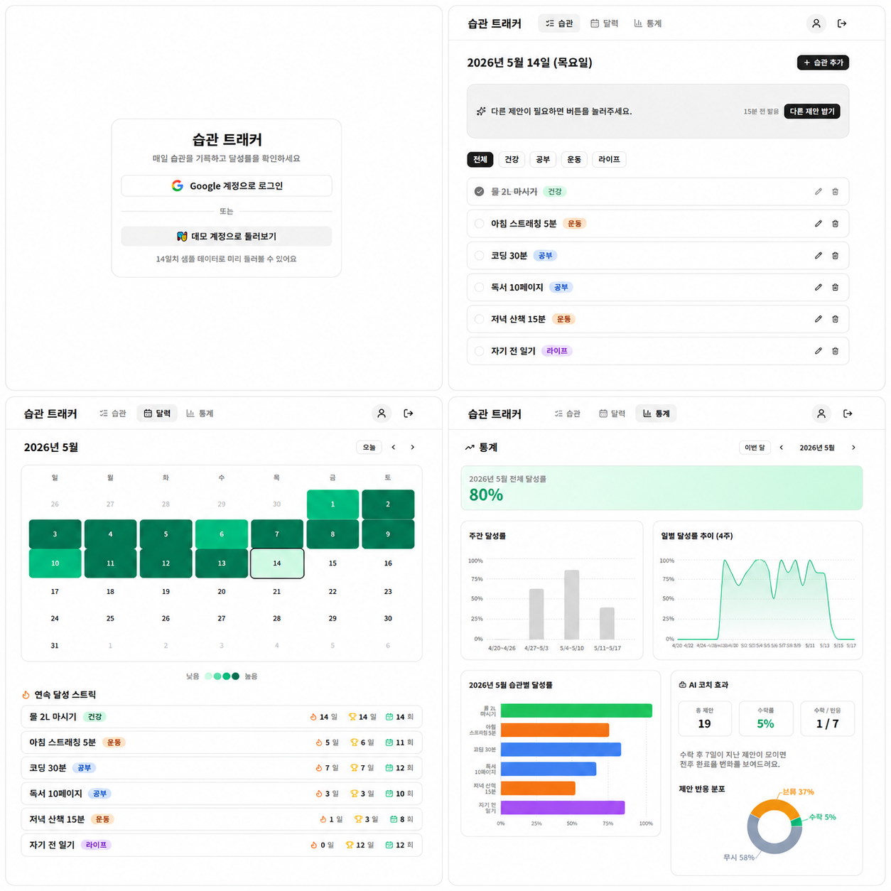
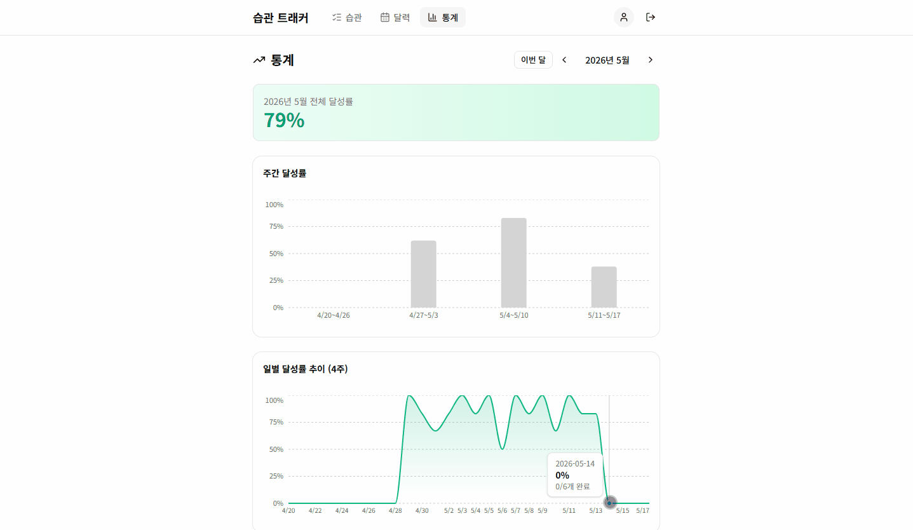
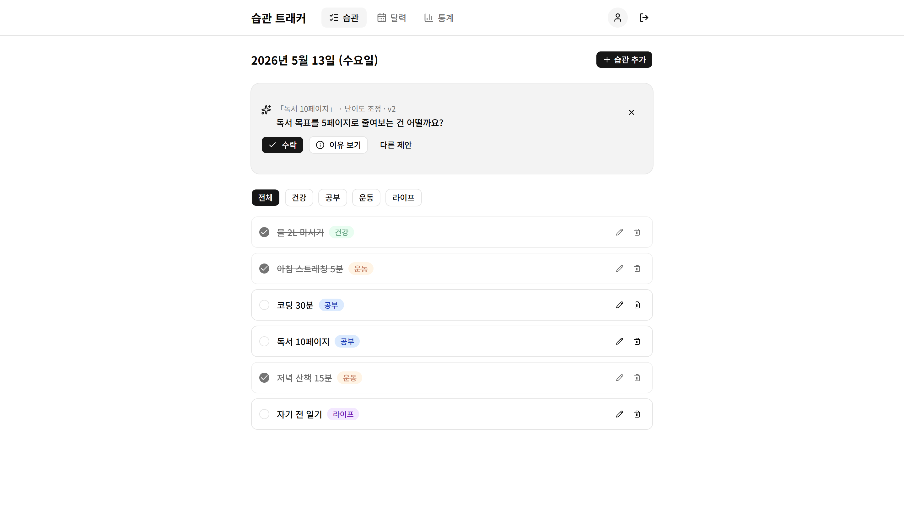
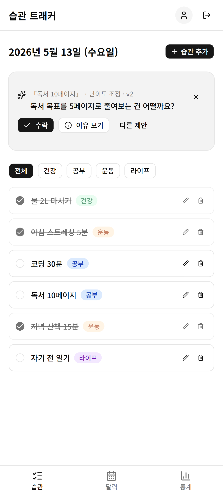
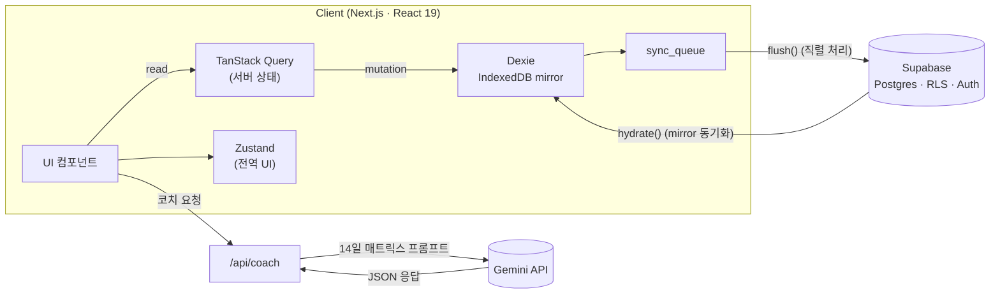

# Habit Tracker

> 오프라인 퍼스트 멀티 기기 동기화와 AI 코치를 갖춘 개인 습관 트래커.
> Next.js 16 · Supabase · IndexedDB · Gemini

- 🔗 **라이브 데모** — <https://habit-tracker-ashy-seven.vercel.app/>
- 🎭 **데모 진입** — 로그인 페이지의 _"데모 계정으로 둘러보기"_ 버튼 한 번 → 14일치 샘플 데이터가 채워진 화면으로 바로 이동합니다.
- 📓 **개발 일지** — [동기화 안정화 사이클 (1주 도그푸딩)](notes/sync-stabilization-log.md)





## 📌 프로젝트 소개

매일 습관을 기록하고 달성률을 시각화하는 개인 생산성 앱입니다.
모바일과 PC를 오가는 사용 환경을 기본 전제로 두고, **오프라인에서도 끊김 없이 작동**하면서 **여러 기기에서 일관된 상태**를 유지하도록 설계했습니다.

## ✨ 주요 특징

### 1. 오프라인 퍼스트 + 멀티 기기 동기화

브라우저의 IndexedDB(Dexie)에 서버 데이터를 미러링하고, 변경 사항은 `sync_queue`에 쌓아 백그라운드에서 Supabase로 전송합니다. 재접속 시에는 hydrate를 통해 서버 상태를 다시 끌어오는 구조입니다.

1주간 직접 사용하며 이 구조에서 발생한 동기화 결함 6가지를 발견·수정하고, 회귀 테스트까지 마무리했습니다. 전체 과정은 [동기화 안정화 일지](notes/sync-stabilization-log.md)에 정리되어 있습니다.

대표적인 사례:

- hydrate의 `bulkPut`이 미러가 아닌 upsert로 동작해, 다른 기기에서 삭제한 데이터가 전파되지 않던 문제
- flush–hydrate 경합으로 삭제된 row가 되살아나는 문제
- signOut 시 로컬 큐를 비우지 않아 다음 로그인 계정으로 이전 변경사항이 푸시되던 사용자 경계 누수 문제

### 2. Gemini 기반 AI 코치





최근 14일치 달성 매트릭스를 프롬프트에 담아 Gemini에 전달하고, **개선 효과가 가장 클 습관 하나**를 선정해 `reschedule / simplify / skip / encourage` 중 한 가지 액션을 제안받습니다. 응답은 `responseSchema`로 JSON 형식을 강제한 뒤 zod로 다시 한 번 검증합니다.

코치의 효과를 측정하기 위해 별도의 텔레메트리 테이블(`coach_events`)을 두었고, 프롬프트 버전(`COACH_PROMPT_VERSION`)을 올리면 **버전별 수락률 비교 차트**가 자동으로 활성화됩니다.

### 3. 상태 관리 책임 분리 (Zustand · TanStack Query)

성격이 다른 상태를 한 도구로 처리하지 않고 책임 단위로 나눴습니다.

- **TanStack Query** — 서버 상태 (습관 목록, 로그, 캐싱과 동기화)
- **Zustand** — 전역 UI 상태 (로그인 유저, 선택된 날짜)
- **`useState`** — 컴포넌트 지역 상태 (편집 중인 습관, 카테고리 필터)

캐시 무효화 같은 **서버 상태 책임이 TanStack Query 한 곳에 모이도록** 정리한 결과, 멀티 기기 동기화 결함 중 한 가지(주간 파생 키 무효화 누락)를 단일 지점에서 수정할 수 있었습니다.

처음에는 지역 상태 담당으로 Jotai를 함께 두어 **3종 분리**로 시작했지만, 3개월 뒤 실제 사용을 확인해보니 atom 하나는 쓰이지 않는 죽은 코드였고 나머지 하나는 부모-자식 관계라 prop 하나로 충분한 자리였습니다. **예상에 기대 미리 도입한 추상화**였다고 판단해 제거했습니다. 도입 근거와 철회 근거를 모두 [ADR-002](notes/adr/0002-state-management-split.md)에 남겨 두었습니다.

## 🛠 기술 스택

| 구분          | 기술                                         |
| ------------- | -------------------------------------------- |
| 프레임워크    | Next.js 16 (App Router) · React 19           |
| 언어          | TypeScript                                   |
| 전역 상태     | Zustand                                      |
| 서버 상태     | TanStack Query                               |
| 로컬 DB       | Dexie (IndexedDB) · `sync_queue`             |
| 원격 DB       | Supabase (PostgreSQL · RLS · Auth)           |
| AI            | Gemini API (`responseSchema` 기반 JSON 응답) |
| UI            | shadcn/ui · Base UI · Tailwind CSS           |
| 차트          | Recharts                                     |
| 폼            | React Hook Form · Zod                        |
| 테스트        | Vitest · React Testing Library · vitest-axe  |
| PWA           | Serwist (Service Worker)                     |
| 모니터링      | Sentry                                       |
| 패키지 매니저 | pnpm                                         |

## 📁 폴더 구조

핵심 로직의 위치는 다음과 같습니다.

- **오프라인 퍼스트 동기화** → [src/lib/db/](src/lib/db/) (`sync.ts`, `hydrate.ts`, `clearLocalData.ts`)
- **AI 코치** → [src/lib/ai/](src/lib/ai/), [src/app/api/coach/](src/app/api/coach/)
- **TanStack Query 훅 (캐시 무효화 등)** → [src/hooks/useHabitLogs.ts](src/hooks/useHabitLogs.ts)

전체 구조는 다음과 같습니다.

```text
src/
├── app/                      # Next.js App Router
│   ├── (auth)/              # 로그인 라우트 그룹
│   ├── (dashboard)/         # 인증 필요 — habits · calendar · stats
│   ├── api/coach/           # AI 코치 API 라우트
│   └── auth/callback/       # OAuth 콜백
├── components/
│   ├── ui/                  # shadcn/ui 기본 컴포넌트
│   ├── habits/              # 습관 도메인 컴포넌트 (HabitCard, AiCoachCard 등)
│   ├── stats/               # 통계·차트 (DailyTrendChart, WeeklyChart 등)
│   ├── auth/ · layout/ · providers/
│   └── OfflineBanner.tsx
├── hooks/                    # TanStack Query 훅 · 동기화 · 인증
├── lib/
│   ├── db/                  # 오프라인 퍼스트 핵심 — IndexedDB · sync_queue · hydrate
│   │   └── repositories/
│   ├── ai/                  # Gemini 클라이언트 · 코치 로직 · 응답 스키마
│   ├── api/                 # Supabase API 래퍼
│   ├── supabase/            # Supabase 클라이언트 · 미들웨어
│   ├── utils/               # 날짜 · 스트릭 계산
│   └── validations/         # Zod 입력 검증 스키마
├── stores/                   # Zustand — 전역 UI 상태
├── tests/                    # Vitest 테스트 (241 케이스)
└── types/                    # TypeScript 타입 정의
```

## 🏗 아키텍처


```mermaid
flowchart LR
    subgraph Client["Client (Next.js · React 19)"]
        UI["UI 컴포넌트"]
        RQ["TanStack Query<br/>(서버 상태)"]
        Z["Zustand<br/>(전역 UI)"]
        Dexie["Dexie<br/>IndexedDB mirror"]
        Queue["sync_queue"]
    end

    Supabase[("Supabase<br/>Postgres · RLS · Auth")]
    Coach["/api/coach"]
    Gemini[("Gemini API")]

    UI -->|read| RQ
    UI --> Z
    RQ -->|"mutation"| Dexie
    Dexie --> Queue
    Queue -->|"flush() (직렬 처리)"| Supabase
    Supabase -->|"hydrate() (mirror 동기화)"| Dexie
    UI -->|"코치 요청"| Coach
    Coach -->|"14일 매트릭스 프롬프트"| Gemini
    Gemini -->|"JSON 응답"| Coach
```

설계 결정 배경은 ADR 두 건에 정리했습니다.

- [ADR-001 — 오프라인 퍼스트 + sync_queue 도입](notes/adr/0001-offline-first-with-sync-queue.md)
- [ADR-002 — 상태 관리 책임 분리 (Zustand · TanStack Query), Jotai 제거 개정 포함](notes/adr/0002-state-management-split.md)

# 🔧 트러블슈팅: 오프라인 퍼스트 동기화 안정화 (ADR-001 · ADR-002)

오프라인 퍼스트 환경에서 발생하던 데이터 불일치, 동시성 경합, 캐시 무효화 누락 문제를 분석하고 해결한 구조적 정리 문서입니다.

---

## 📌 이슈 및 해결 방법 요약

| 구분 | 발생 문제 (Problem) | 핵심 원인 (Root Cause) | 해결 방법 (Solution) | 관련 결함 (Bug) |
| :--- | :--- | :--- | :--- | :--- |
| **1. 삭제 반영** | 서버에서 지운 데이터가 로컬 DB에 그대로 남아있음 | 기존 `bulkPut` 하이드레이션이 덮어쓰기만 수행하여 삭제 레코드 감지 불가 | **서버 기준 미러링 (전체 동기화)** | B1, B5 |
| **2. 동시성 제어** | 재접속 시 데이터가 어긋나거나 동기화 전체가 먹통이 됨 | 하이드레이션-플러시 간 레이스 컨디션 및 실패 작업의 HOL 블로킹 발생 | **쓰기 잠금 (`locked ids`) & 재시도 한도 설정 (`MAX_SYNC_RETRIES`)** | B2, B3, B6 |
| **3. 캐시/상태** | DB 데이터는 변경되었으나 화면 UI(주간 그래프 등)가 갱신되지 않음 | 상태 관리 파편화로 인해 주간 파생 키 등 특정 캐시 무효화 누락 | **TanStack Query 기반 캐시 무효화 단일화 (ADR-002)** | B4 |

---

## 🚨 문제점 분석 및 세부 해결책

### 1. [삭제 반영] 서버 삭제 레코드가 로컬 DB에 잔존하는 결함

* **현상**: 서버 또는 다른 기기에서 삭제된 데이터가 특정 기기의 로컬 IndexedDB에 유령 레코드로 지속 남아있는 현상 (**B1**, **B5**)
* **원인**: 기존 하이드레이션(hydration) 로직이 `bulkPut` 단방향 삽입/갱신으로만 동작하여, 서버상에서 이미 삭제된 레코드를 감지하거나 제거하지 못함.
* **해결 방법**: **서버 기준 미러링(전체 동기화) 구조 전환**
  * 하이드레이션을 단순히 변경분(delta)을 누적하는 방식에서 **'서버 최신 스냅샷' 기준 전체 동기화** 방식으로 재정의.
  * 서버에 존재하지 않지만 로컬에만 남아 있던 유령 레코드를 동기화 시점에 정교하게 동기화 및 제거.

---

### 2. [동시성 제어] 동시 재접속 시 레이스 컨디션 및 HOL 블로킹 발생

* **현상**: 오프라인 상태 후 재접속 시 데이터가 덮어씌워지거나 (**B2**, **B3**), 한 번 실패한 동기화 작업이 이후 모든 동기화 큐를 막아버리는 현상 (**B6**)
* **원인**:
  1. 서버 데이터를 내려받는 **하이드레이션**과 로컬 변경분을 올려주는 **플러시(flush)**가 동시 실행되어 **레이스 컨디션** 발생.
  2. 네트워크 이상 등으로 실패한 작업이 동기화 큐 상단에 남아 후속 작업을 지속 차단하는 **HOL(Head-of-Line) 블로킹** 발생.
* **해결 방법**: **쓰기 잠금(Write Lock) 도입 및 재시도 상한 격리**
  * **[레이스 컨디션 차단]** 플러시 진행 중인 레코드 ID를 `locked`로 지정하여 하이드레이션 프로세스가 해당 항목을 덮어쓰지 못하도록 구조적으로 차단 (`src/lib/db/hydrate.ts`).
  * **[HOL 블로킹 해소]** `MAX_SYNC_RETRIES = 5` 상한을 설정하여, 5회 이상 실패한 작업은 큐에서 즉시 격리·폐기함으로써 전체 동기화 파이프라인의 연속성 보장 (`src/lib/db/sync.ts`).

---

### 3. [캐시/상태] 데이터 동기화 후 파생 UI(주간 그래프 등) 미갱신

* **현상**: 데이터 수정/체크 작업 후 원본 데이터는 변경되었으나 통계 UI 등 파생 뷰가 즉시 업데이트되지 않는 현상 (**B4**)
* **원인**: 서버 상태 관리가 여러 곳으로 파편화되어 있어, 날짜별(`byDate`), 월별(`byMonth`) 외의 **주간 단위 파생 키 무효화**가 누락됨.
* **해결 방법**: **캐시 무효화 단일화 (ADR-002)**
  * 클라이언트의 서버 상태 관리 책임을 **TanStack Query 한 곳으로 일원화**.
  * 단일 진입점에서 주간 파생 키를 포함한 전체 관련 캐시를 일괄 무효화 및 자동 재요청하도록 개선 (`src/hooks/useHabitLogs.ts`).

---

## 📈 도그푸딩 및 검증 결과

1주일간의 프로덕션 실사용 검증을 통해 초기 동기화·캐시 결함 **6가지(B1~B6)** 및 추가 결함 **2가지(B7~B8)** 를 발견하고 모두 해결하였습니다.

## 🚀 로컬에서 실행

```bash
pnpm install
cp .env.example .env.local   # Supabase URL/anon key, Gemini API 키 입력
pnpm dev                     # http://localhost:3000
pnpm test                    # 회귀 테스트 (236 케이스)
```

Node.js 20+ · pnpm · Supabase 프로젝트 · Gemini API 키 필요.
